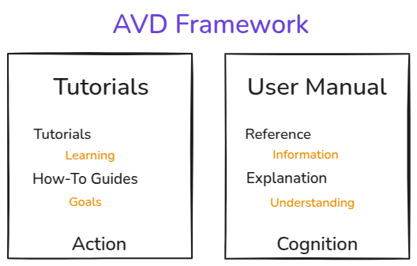

<!--
  ~ Copyright (c) 2025 Arista Networks, Inc.
  ~ Use of this source code is governed by the Apache License 2.0
  ~ that can be found in the LICENSE file.
  -->

# Diataxis Framework

Start applying the [diataxis](https://diataxis.fr/) framework to the AVD documentation site

1. Understanding the framework
2. Applying the framework


## Definitions

- **Learning**: The process of acquiring new knowledge, skills, values, or behaviors through study, experience, or being taught. It's about gaining competence.

- **Goals**: The specific aim or desired result of an effort or ambition. Goals provide a target to direct actions and measure success.

- **Information**: Raw facts, data, statistics, or details about a subject. It's the "what" of a topic, without interpretation or context.

- **Understanding**: The ability to comprehend or grasp the meaning, significance, and nature of something. It involves interpreting information to see connections and context.

- **Acquisition**: The act of gaining or acquiring something. In this context, it refers to the process of obtaining knowledge, skills, or information.

- **Application**: The act of putting something to a practical use. It involves applying acquired knowledge or tools to solve a real-world problem.

- **Action**: The process of doing something. It refers to the practical steps and activities involved in performing a task or achieving a goal.

- **Cognition**: The mental process of acquiring knowledge and understanding through thought, experience, and the senses. It involves thinking, reasoning, and remembering.

| If the content… | …and serves the user's… | …then it must belong to… |
| :--- | :--- | :--- |
| informs action | acquisition of skill | a tutorial |
| informs action | application of skill | a how-to guide |
| informs cognition | application of skill | reference |
| informs cognition | acquisition of skill | explanation |

| | Tutorials | How-to guides | Reference | Explanation |
| :--- | :--- | :--- | :--- | :--- |
| **what they do** | introduce, educate, lead | guide | state, describe, inform | explain, clarify, discuss |
| **answers the question** | “Can you teach me to…?” | “How do I…?” | “What is…?” | “Why…?” |
| **oriented to** | learning | goals | information | understanding |
| **purpose** | to provide a learning experience | to help achieve a particular goal | to describe the machinery | to illuminate a topic |
| **form** | a lesson | a series of steps | dry description | discursive explanation |
| **analogy** | teaching a child how to cook | a recipe in a cookery book | information on the back of a food packet | an article on culinary social history |

### Compass

| | Tutorials | How-to guides | Reference | Explanation |
| :--- | :--- | :--- | :--- | :--- |
| **Analogy** | Teaching a child how to cook | A recipe in a cookery book | A dictionary | An article on culinary social history |
| **Form** | A lesson, that builds understanding | A series of steps to follow | A description of the machinery | Discursive, like an article |
| **Purpose** | To provide a learning experience | To help the user achieve a goal | To state, describe and specify | To explain, clarify and discuss |
| **User's goal** | Learning | A particular goal | Information | Understanding |
| **Path** | Prescribed and linear | The user’s own | The user’s own | The user’s own |

## Examples

- [Ubuntu](https://documentation.ubuntu.com/server/) **- Bad**
- [Ansible](https://docs.ansible.com/ansible/latest/index.html) **- Bad**
- [Kubernetes](https://kubernetes.io/docs/home/) **- Good**
- [Cloudflare](https://developers.cloudflare.com/products/)
- [Container Lab](https://containerlab.dev/) **- Excellent**

### Structure

| Ubuntu | Ansible | Kubernetes | Cloudflare |
| :--- | :--- | :--- | :--- |
| Tutorial | Getting Started | Concepts | Concepts |
| How-to guides |  Using Ansible | Tasks | *Function Specific* |
| Reference | Reference & Appendices | Reference | Reference |
| Explanation |  |  | Troubleshooting |

### Pros and Cons

| Product | Pros | Cons |
| - | - | - |
| Ubuntu | Simple follows the framework to the letter  |  |
| Ansible | Great reference structure, easy to follow between different projects | Hard to follow documentation structure |

## Proposed Framework



## Organisation/Structure

### Key design principals

- Easy to navigate
- Clear navigation headers
- Optimize page length for content and performance
- Use container labs has a reference model
- Use some components from diataxis and containerlab
- Remove Roles concept as this is an ansiblism, focus on cloudvision integration model

### Proposed changes

- Move Navigation headers horizontally
- collapse tutorials and how-to guides **[Tutorials]**
- collapse reference and explanation **[User Manual]**

> ***Note:*** The current structure is designed to be flexible. As the project evolves, we can separate the content into more granular sections to maintain clarity and organization
>
## Navigation Menu

### Discussion

#### Changes

- Move the Main Navigation Menu Horizontally to the top of the Page

#### Questions

- Do we remove completely the navigation menu on the left?
- Where do we move Ansible Collection Plugins
- Do we repeat subjects in Tutorials and User Manual
- Do we create a video section
- Organisation [alphabetical, most common, ..]
- Maybe nest Examples under How-to Guides
- AAEP where to move

### Current Navigation

```yaml
Home
Getting Started
Examples
Installation
Ansible Collection Roles
Ansible Collection plugins
Contributing to avd
Release Notes
Porting Guide
PyAVD
Versioning
AVD Dev Containers
Support
```

### Proposed Navigation

```yaml
Home
Quick Start
Installation
How-to Guides
User Manual
Examples
Release Notes
Contribute
Support
```

#### Horizontally

[aclabs](https://aclabs.arista.com/)


```yaml
Home   Quick Start   Installation   Tutorials   User Manual   Topology Examples   Release Notes   Contribute   Support
```

## Quick Start

### Definition

A quick start is a condensed set of instructions designed to help a user begin using a product or service as quickly as possible, focusing only on the most essential steps.
Its primary goal is to get a user to a basic, functional state immediately, bypassing comprehensive details and advanced features. A quick start guide prioritizes speed and immediate results over thorough understanding.

- **Minimalist**: It includes only the critical information needed to get started.
- **Action-Oriented**: It focuses on a sequence of actions rather than explaining concepts.
- **Fast**: It's designed to be completed in a very short amount of time.
- **Not Comprehensive**: It intentionally omits advanced options, detailed explanations, and troubleshooting for edge cases.

### Questions/Discussion

1. Do we need a separate section for local and cvaas?

### Proposed Structure

```yaml
Table of contents

Installation
Inventory
Inputs (group_vars)
  Fabric (physical)
    Common Settings
    Node Types
      Defaults
      Nodes
      Node Groups
  Network Services (logical)
  Connected Endpoint (clients)
Workflow
  Build (playbook)
  Deploy (playbook)
  Validate (playbook)
Folder Structure (outputs)
  Intended
  Documentation
```

### With Topics

``` yaml
Table of contents

Installation
  pip [topic]
  uv [topic]
Inventory
Inputs
  Fabric (physical)
    Node Types [section]
      spine [topic]
      l3leaf [topic]
      l2leaf [topic]
    Defaults [section]
    Nodes [section]
    Node Groups [section]
    Common Settings [section]
      connectivity [topic]
      fabric_name [topic]
      local_users [topic]
      mgmt_gateway [topic]
      dns_settings [topic]
      ntp_settings [topic]
  Network Services (logical)
  Connected Endpoint (clients)
Build

Deploy
Outputs [Maybe]
```

## Tutorials [How-to Guides]

### Definition

A tutorial is a step-by-step learning experience designed for a beginner. It guides the user through a series of practical steps to complete a specific task from start to finish. The goal is to build foundational skills and understanding.

- **Goal**: To teach a user how to do something.
- **Structure**: Linear and sequential (Step 1, Step 2, Step 3...).
- **Analogy**: A cooking class or a guided project.
- **Use Case**: You're new to a photo editing app and follow a tutorial to learn how to remove a background from an image.

### Question/Discussion

1. Do we use Tutorials or How-to Guides

### Proposed Structure

```yaml
Node Types
  Definition
  Defaults
Connected Endpoints
Network Services

Current How-to's
  Configuring PTP
  Configuring WAN
  Custom Descriptions and Names
  Custom Structured Configuration
  Custom Templates x2 [eos_desigs, eos_cli_config_gen]
  Generate Cloudvision Tags
```

[Configuring PTP](https://avd.arista.com/5.5/ansible_collections/arista/avd/roles/eos_designs/docs/how-to/ptp.html)

## User Manual

### Definition

A `user manual` is a comprehensive reference guide that describes a product's features and functions in detail. It's not meant to be read from start to finish. Instead, users consult it when they have a specific question or need to understand a particular feature.

- **Goal**: To inform and provide technical details.
- **Structure**: Topical and organized for quick look-ups (like a dictionary or encyclopedia).
- **Analogy**: A car's owner manual or a technical encyclopedia.
- **Use Case**: You already know how to use the photo editing app, but you look up the "Magic Wand Tool" in the manual to see its specific tolerance settings.

### Question/Discussion

1. What sections can we move here?
   - Input Variables
   - Getting Started
   - Ansible Plugins
   - Ansible Roles [Overview]
   - PyAVD
   - AVD Dev Containers

### Current Structure

```yaml
Ansible Collection Roles
  eos_designs
    Input Variables
      Supported designs
      Design Type
      Fabric Topology
      Fabric IP Addressing
      Fabric Numbering
      Node Type Variables
      Node Type Customization
      Type Settings
      Default Node Type Settings
      Node Type Settings
      Default Interface Settings
      L3 Edge and DCI
      Core Interfaces Settings
      Flagging a device as not deployed
      Fabric Settings
      Management Interface Settings
      BFD Settings
      BGP Settings
      ACL Settings
      OSPF Settings
      Overlay Settings
      EVPN Settings
      WAN Settings
      Management Settings
      Monitoring
      QoS
      System Settings
      Cloud Vision
      Endpoint Connectivity
      Network Services
      Platform Settings
      PTP Settings
      Custom Structure
      CloudVision Topology
      Digital Twin
  eos_cli_config_gen
    Input Variables
      Authentication
      ACLs
      Endpoint Security
      Filters and Policies
      Interfaces
      Maintenance Mode
      Management
      Miscellaneous
      Monitoring
      Multicast
      Quality of Service
      Routing
      Security
      Switching
      System Settings
      Metadata
```

### Proposed Structure

```yaml
Concepts
  Build
  Deploy
  Validate
Node Types
Network Services
Connected Endpoints
Input Variables
  Node Types
    Variables
    Settings
    Customization
    Defaults
  Top Level Keys
    default_interfaces
    l3_edge
    core_interfaces
    is_deployed
  Fabric Settings
  Management Interface Settings
  BFD Settings
  BGP Settings
  ACL Settings
  OSPF Settings
  Overlay Settings
  EVPN Settings
  WAN Settings
  Management Settings
  Monitoring
  QoS
  System Settings
  Cloud Vision
  Endpoint Connectivity
  Network Services
  Platform Settings
  PTP Settings
  Custom Structure
  CloudVision Topology
  Digital Twin
PyAVD
AVD Dev Containers
```

## Change log [Release Notes]

A great category for versioning, porting guides, and release notes would be something that clearly communicates to the user that this section is all about changes, updates, and managing different versions of the software.

Here are a few excellent options, from most to least formal:

1. **Versioning & Releases**
Why it works: This is the most direct and technically accurate category. It uses the exact keywords for the content, making it very clear for developers and technical users. "Versioning" covers the policy, and "Releases" covers the specific artifacts like notes and guides.

2. **Releases & Upgrades**
Why it works: This is a very user-focused option. It highlights the main goal a user has when visiting this section: to learn about new releases and figure out how to upgrade. It's a bit more action-oriented.

3. **Release Information**
Why it works: A simple, all-encompassing, and safe choice. It's slightly more generic but still clearly communicates the purpose of the documents within.

4. **Changelog**
Why it works: In many modern software projects, "Changelog" is used as the top-level category for all release-related information. It's a very common and understood term. You would typically have the release notes directly on the main page and then link to versioning policies and porting guides from there.

```yaml
Porting Guide
Release Notes
Versioning
```

## Example - converting existing How-to guide with gemeni

### Question in Gemini

```yaml
transform this url in a tutorial
https://avd.arista.com/5.5/ansible_collections/arista/avd/roles/eos_designs/docs/how-to/ptp.html
```

### Response

## Tutorial: Your First PTP Configuration with AVD

**Goal:** In this tutorial, you'll learn how to implement a basic, stable Precision Time Protocol (PTP) configuration for an entire network fabric using Arista Validated Designs (AVD).

**Scenario:** We have a simple fabric and our goal is to enable PTP everywhere using the default settings, ensuring our spine switches are the preferred clock sources. We also need to provide PTP timing to one connected server.

### Step 1: Enable PTP for the Entire Fabric

First, we need to turn PTP on. The easiest way to ensure PTP is active everywhere is to enable it globally. This single setting provides a consistent baseline for all switches.

In your main fabric inventory file (e.g., `fabric.yml`), add the following:

```yaml
ptp_settings:
  enabled: true
```

That's it! With this one change, AVD will now generate the basic PTP configuration for all spine and leaf switches.

### Step 2: Review the Default PTP Profile

AVD is designed with smart defaults. Now that PTP is enabled, it automatically applies the **`aes67-r16-2016`** profile. For this tutorial, we will stick with this default.

This profile provides a balanced rate of PTP messages (8 sync messages per second), making it suitable for a wide range of applications. You don't need to configure anything in this step; just be aware that AVD has already selected a sensible profile for you.

### Step 3: Understand Automatic Priorities

With PTP enabled, a process called the **Best Master Clock Algorithm (BMCA)** runs to elect the most stable clock source. AVD helps ensure this election has a predictable and stable outcome.

You don't need to add any configuration here, but AVD is already doing the following for you in the background:

- It has given your **spine switches a PTP priority of 20**.
- It has given your **leaf switches a PTP priority of 30**.

Since a lower number wins, the spines will always be preferred as clock sources over the leaves. This creates a stable hierarchy automatically.

### Step 4: Enable PTP for a Connected Server

Now, let's provide PTP to a device connected to one of our leaf switches. By default, PTP is **not** enabled on endpoint-facing ports, so we must enable it manually.

In your inventory file where you define your servers, find the server that needs PTP and add the `ptp` block to its adapter configuration.

```yaml
servers:
  - name: my-media-server
    adapters:
    - switch_ports: [ Ethernet7 ]
      switches: [ leaf1a ]
      # Add this block to enable PTP for the server
      ptp:
        enabled: true
```

This tells AVD to enable PTP specifically on port `Ethernet7` of switch `leaf1a`, allowing `my-media-server` to receive timing information.

### Step 5: Review and Deploy

Let's review the simple but powerful configuration we've built. Your PTP settings in your inventory files should look something like this:

**In `fabric.yml`:**

```yaml
ptp_settings:
  enabled: true
```

**In your server inventory file:**

```yaml
servers:
  - name: my-media-server
    adapters:
    - switch_ports: [ Ethernet7 ]
      switches: [ leaf1a ]
      ptp:
        enabled: true
```

Now, you can run the AVD playbook to deploy your configuration. Once deployed, you can log into a switch and use the command `show ptp` to verify that PTP is active and see the clock's status.

### Congratulations

You've successfully configured a robust, stable PTP setup for your entire fabric and a connected endpoint. You learned how to enable PTP globally and for specific interfaces, and you understood how AVD's smart defaults for profiles and priorities work to your advantage.

From here, you could try experimenting with different **PTP profiles** or **manually setting a priority** for a specific switch to further your understanding.

## Now User Manual example

## AVD PTP Configuration User Manual

### **Document Version:** 5.5

This manual provides a comprehensive reference for all parameters related to the configuration of Precision Time Protocol (PTP) within the Arista Validated Designs (AVD) framework.

## **1. PTP Overview**

AVD provides a structured data model for configuring PTP on Arista EOS devices. The configuration is hierarchical, allowing for settings to be applied globally at the fabric level and overridden at more specific levels, such as per node type, group, or individual device.

Key features include:

- **PTP Profiles:** Pre-defined sets of PTP parameters for common industry standards.
- **Automatic Priority Management:** Intelligent assignment of PTP priorities to ensure a stable clock hierarchy.
- **Automatic Clock Identity:** Predictable generation of PTP clock identities for easier management.

## **2. Global PTP Settings**

These parameters are defined under the `ptp_settings` key at the fabric level (e.g., in `FABRIC.yml`).

| Parameter | Type | Description | Default |
| :--- | :--- | :--- | :--- |
| **`enabled`** | Boolean | Globally enables or disables PTP for the fabric. | `false` |
| **`profile`** | String | Sets the PTP profile for all devices. Accepted values are `aes67`, `smpte2059-2`, `aes67-r16-2016`. | `aes67-r16-2016` |
| **`auto_clock_identity`**| Boolean | Enables or disables automatic generation of the PTP clock identity. If `false`, the system MAC is used. | `true` |
| **`clock_identity_prefix`**| String | Sets a custom 3-byte prefix for the auto-generated clock identity. Must be a quoted string (e.g., `"01:02:03"`). | `"00:1C:73"` |

## **3. Node and Group Level Settings**

These parameters are configured under the `ptp:` key and can be set at multiple levels (per-node, per-group, per-node-type).

### **3.1. General PTP Configuration**

| Parameter | Type | Description | Default |
| :--- | :--- | :--- | :--- |
| **`enabled`** | Boolean | Enables or disables PTP for the specific scope (node, group, etc.). Overrides global setting. | `false` |
| **`profile`** | String | Overrides the fabric-level PTP profile for the specific scope. | Inherited |
| **`domain`** | Integer | Sets the PTP domain number (0-255). | `null` |
| **`forward_unicast`** | Boolean | Enables hardware forwarding of unicast PTP packets. | `false` |
| **`source_ip`** | String | Manually sets the source IPv4 address for PTP packets. | `null` |
| **`ttl`** | Integer | Manually sets the Time-To-Live for PTP packets. | `1` |
| **`mlag`** | Boolean | If `true`, configures PTP on the MLAG peer-link Port-Channel. | `false` |

### **3.2. PTP Priority Configuration**

| Parameter | Type | Description | Default |
| :--- | :--- | :--- | :--- |
| **`priority1`** | Integer | Manually overrides the PTP priority 1 value (0-255). Lower is higher priority. | `20` for spines, `30` for leaves, `127` otherwise |
| **`priority2`** | Integer | Manually overrides the PTP priority 2 value (0-255). | `node_id % 256` |

### **3.3. PTP Clock Identity Configuration**

| Parameter | Type | Description | Default |
| :--- | :--- | :--- | :--- |
| **`auto_clock_identity`**| Boolean | Overrides the fabric-level `auto_clock_identity` setting. | Inherited |
| **`clock_identity_prefix`**| String | Overrides the fabric-level prefix for the auto-generated clock identity. | Inherited |
| **`clock_identity`** | String | Manually sets the entire 6-byte clock identity (e.g., `"01:02:03:04:05:06"`). | `null` |

### **3.4. PTP Monitoring Configuration**

These parameters are configured under `ptp.monitor`.

| Parameter | Type | Description | Default |
| :--- | :--- | :--- | :--- |
| **`enabled`** | Boolean | Enables or disables the PTP monitor feature. | `true` |
| **`threshold.offset_from_master`**| Integer| Sets the threshold in nanoseconds for the offset from the master clock. | `250` |
| **`threshold.mean_path_delay`** | Integer | Sets the threshold in nanoseconds for the mean path delay. | `1500` |
| **`sequence_ids.enabled`** | Boolean | Enables monitoring of missing messages based on sequence IDs. | `true` |
| **`sequence_ids.announce`** | Integer | Sets the number of missing announce messages to tolerate. | `3` |
| **`sequence_ids.delay_resp`** | Integer | Sets the number of missing delay response messages to tolerate. | `3` |
| **`sequence_ids.follow_up`** | Integer | Sets the number of missing follow-up messages to tolerate. | `3` |
| **`sequence_ids.sync`** | Integer | Sets the number of missing sync messages to tolerate. | `3` |

## **4. Interface-Specific PTP Configuration**

### **4.1. Connected Endpoints (Servers)**

These parameters are configured under a server's `adapters` definition.

| Parameter | Type | Description | Default |
| :--- | :--- | :--- | :--- |
| **`ptp.enabled`** | Boolean | Enables PTP on the switch port connected to the endpoint. | `false` |
| **`ptp.endpoint_role`** | String | Defines the PTP role for the endpoint interface. `bmca` allows participation in the clock election. | `follower` |
| **`ptp.profile`** | String | Sets a specific PTP profile for this interface, overriding the global profile. | Inherited |

### **4.2. P2P (Switch-to-Switch) Links**

These parameters are for dedicated point-to-point links configured under `core_interfaces.p2p_links`.

| Parameter | Type | Description | Default |
| :--- | :--- | :--- | :--- |
| **`ptp.enabled`** | Boolean | Enables PTP on the point-to-point link. | `false` |
| **`include_in_underlay_protocol`**| Boolean | If `false`, the link will be configured as a routed port without an IP address and will not be used for data plane routing. | `true` |
